# help-desk-ticket-lab

Hands-on help desk lab demonstrating Active Directory account management, password resets, network troubleshooting, and new employee onboarding.

## Lab Overview

In this project, I simulated four common help desk tickets using a Windows Server 2022 domain controller and a Windows 11 domain-joined workstation.

For each ticket, I worked through the issue using a basic help desk workflow:

**Problem → Diagnosis → Resolution → Verification**

The lab focused on Active Directory account support, password management, network troubleshooting, and new employee onboarding.

## Lab Environment

- Windows Server 2022
- Windows 11
- Active Directory Domain Services (AD DS)
- Active Directory Users and Computers (ADUC)
- DNS
- Oracle VirtualBox
- Domain: `alvarolab.local`
- Domain Controller: `DC01`
- Client Workstation: `CLIENT01`

---

# Ticket 1 — Locked User Account

## Problem

John Smith reported that he was unable to sign into his workstation after multiple unsuccessful login attempts.

The domain account became locked after exceeding the configured account lockout threshold.

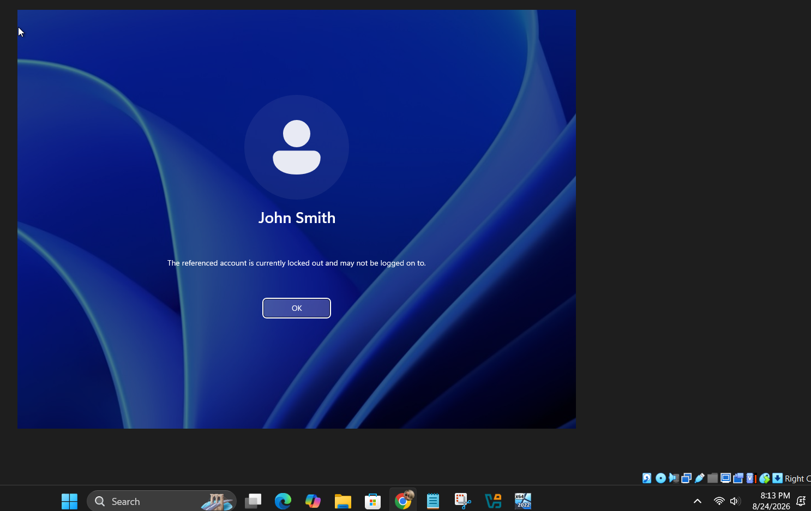

## Diagnosis

I opened Active Directory Users and Computers on DC01 and located John Smith's account in the Employees organizational unit.

I opened the account properties and confirmed that the account was locked.

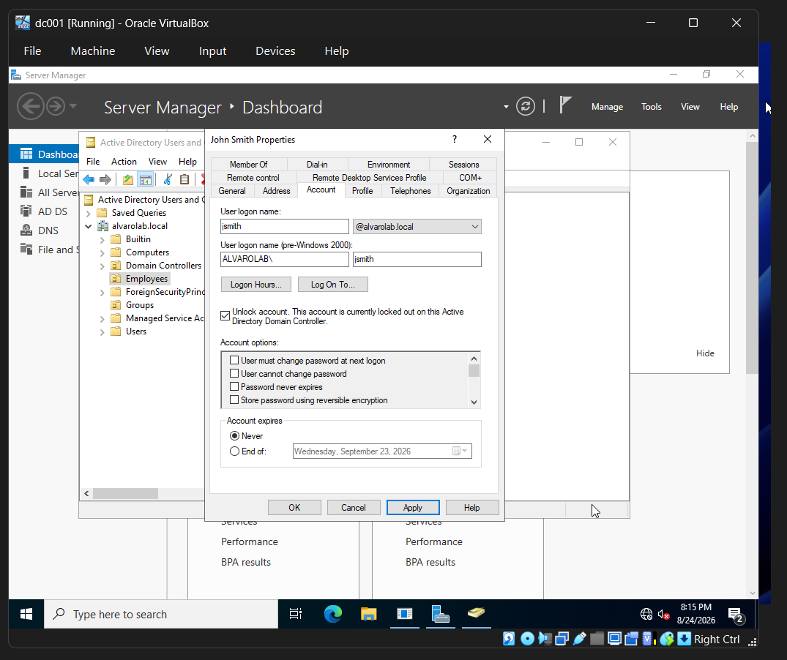

## Resolution

I unlocked John Smith's domain account through Active Directory Users and Computers and applied the change.

## Verification

After unlocking the account, I returned to CLIENT01 and successfully authenticated using John Smith's domain account.

I used the `whoami` command to verify that the authenticated user was:

`alvarolab\jsmith`

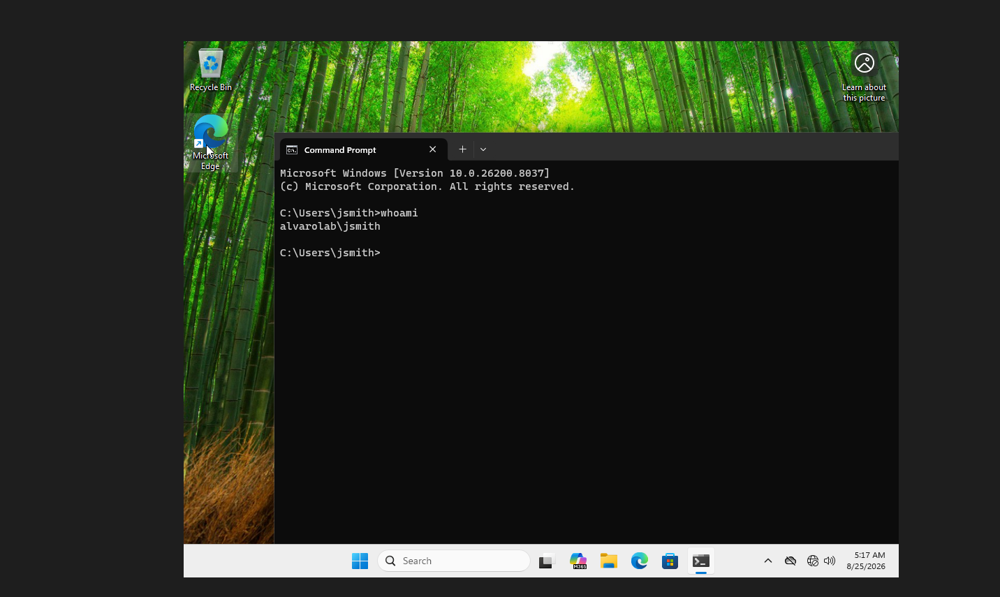

### Ticket Resolution

**Status: Resolved**

The user's Active Directory account was unlocked and domain authentication was successfully restored.

---

# Ticket 2 — Password Reset

## Problem

John Smith was unable to access his workstation because he needed his domain password reset.

## Diagnosis

I located John Smith's account in Active Directory Users and Computers and determined that an administrator password reset was required.

## Resolution

I used the Active Directory **Reset Password** function to assign a new password to the user's domain account.

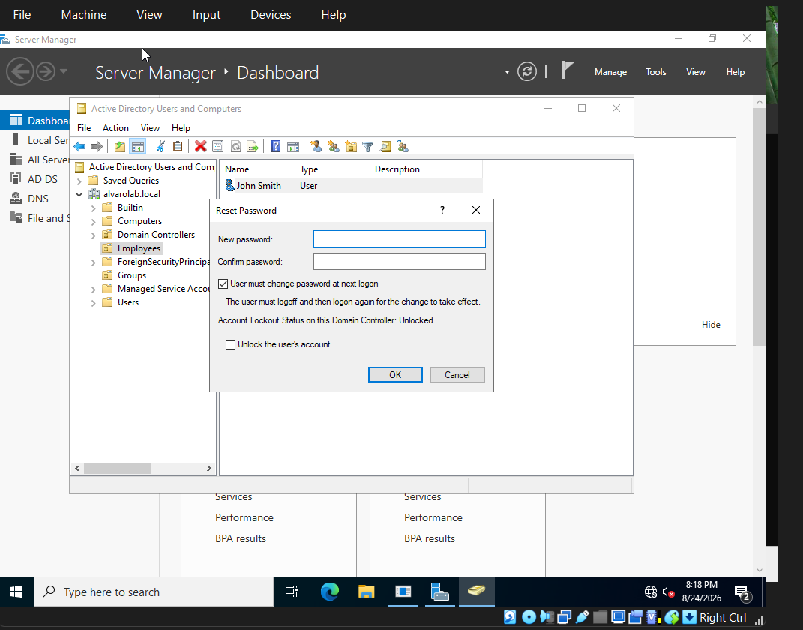

Active Directory confirmed that the password was successfully changed.

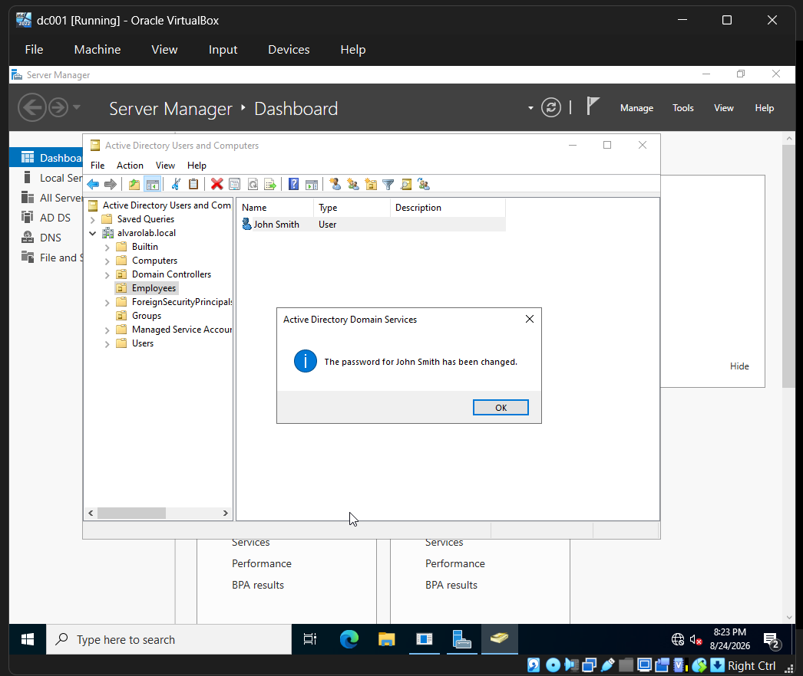

## Verification

I returned to CLIENT01 and successfully authenticated using John Smith's updated credentials.

I used `whoami` to verify the domain identity:

`alvarolab\jsmith`

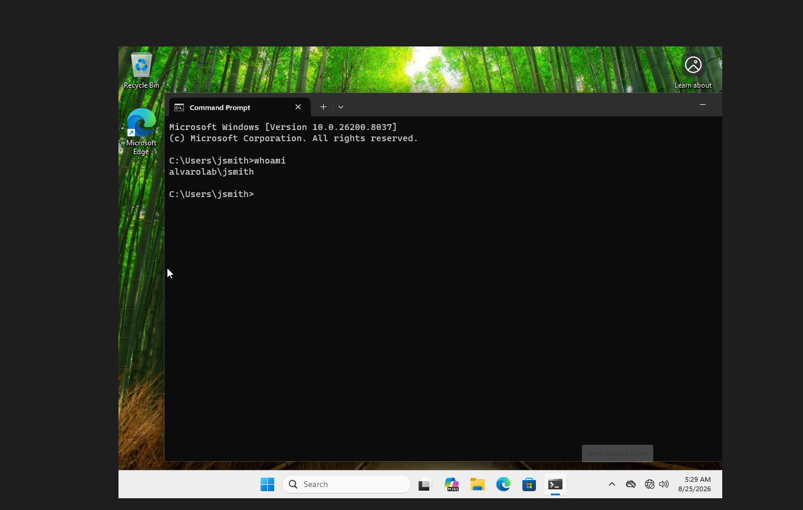

### Ticket Resolution

**Status: Resolved**

The user's password was reset through Active Directory and successful domain authentication was verified from the client workstation.

---

# Ticket 3 — Network Connectivity Failure

## Problem

CLIENT01 was unable to communicate with the domain controller at `192.168.10.10`.

Testing connectivity using `ping` resulted in failed requests and 100% packet loss.

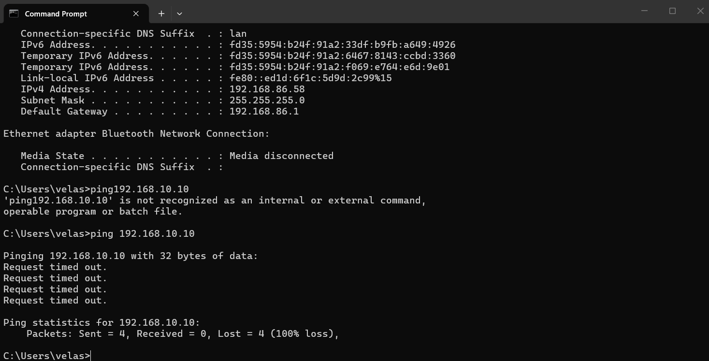

## Diagnosis

I used Windows networking tools including `ipconfig` and `ping` to investigate the workstation's network configuration.

During troubleshooting, CLIENT01 showed an incorrect or unavailable IPv4 configuration and was unable to communicate with DC01.

The correct CLIENT01 configuration for the lab was:

- IP Address: `192.168.10.20`
- Subnet Mask: `255.255.255.0`
- DNS Server: `192.168.10.10`

## Resolution

I restored CLIENT01's static IPv4 configuration and ensured that the workstation was returned to the same subnet as the domain controller.

## Verification

After correcting the configuration, I tested connectivity to DC01 again:

`ping 192.168.10.10`

CLIENT01 successfully received replies from the domain controller with **0% packet loss**.

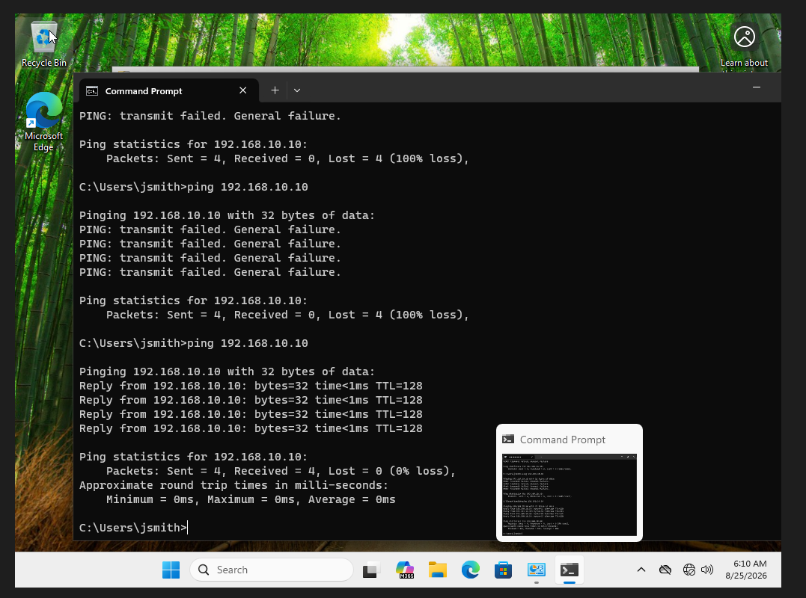

### Ticket Resolution

**Status: Resolved**

The workstation's network configuration was corrected and connectivity to the domain controller was successfully restored.

---

# Ticket 4 — New Employee Onboarding

## Request

A new employee, Sarah Johnson, required a domain account and membership in the IT-Support security group.

## Account Creation

Using Active Directory Users and Computers, I created a new domain account with the username:

`sjohnson`

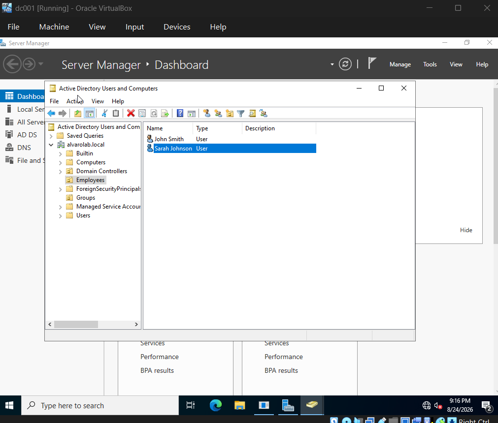

I placed the account in the Employees organizational unit.

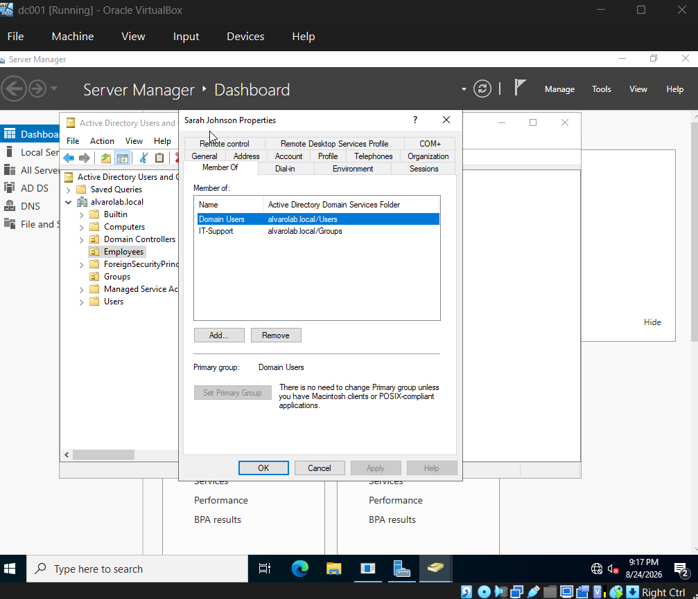

## Group Assignment

I added Sarah Johnson to the `IT-Support` Active Directory security group to provide the appropriate group-based access.

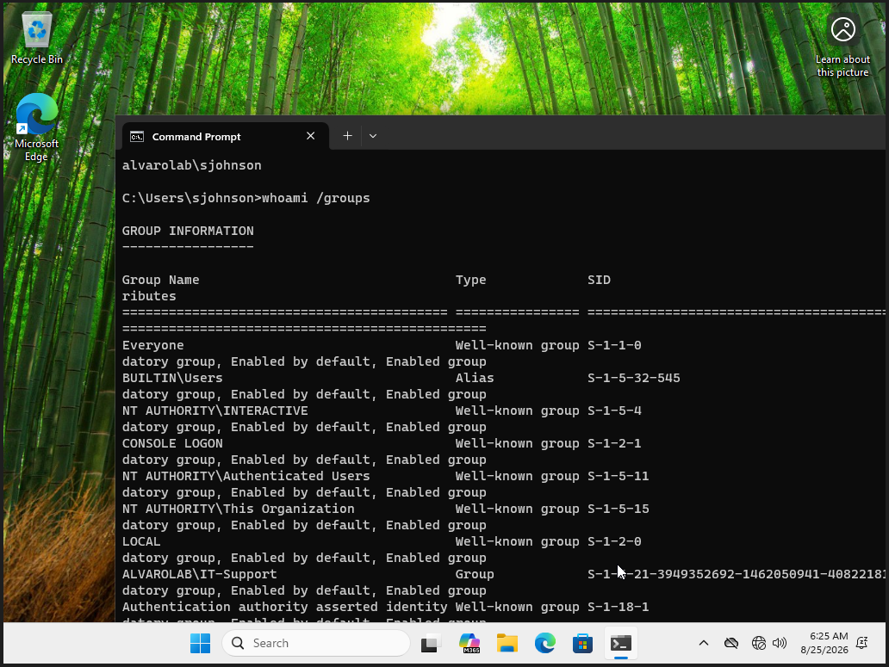

## Verification

I signed into CLIENT01 using Sarah Johnson's new domain account.

I ran:

`whoami`

which verified:

`alvarolab\sjohnson`

I also ran:

`whoami /groups`

and verified that the authenticated account was a member of:

`ALVAROLAB\IT-Support`

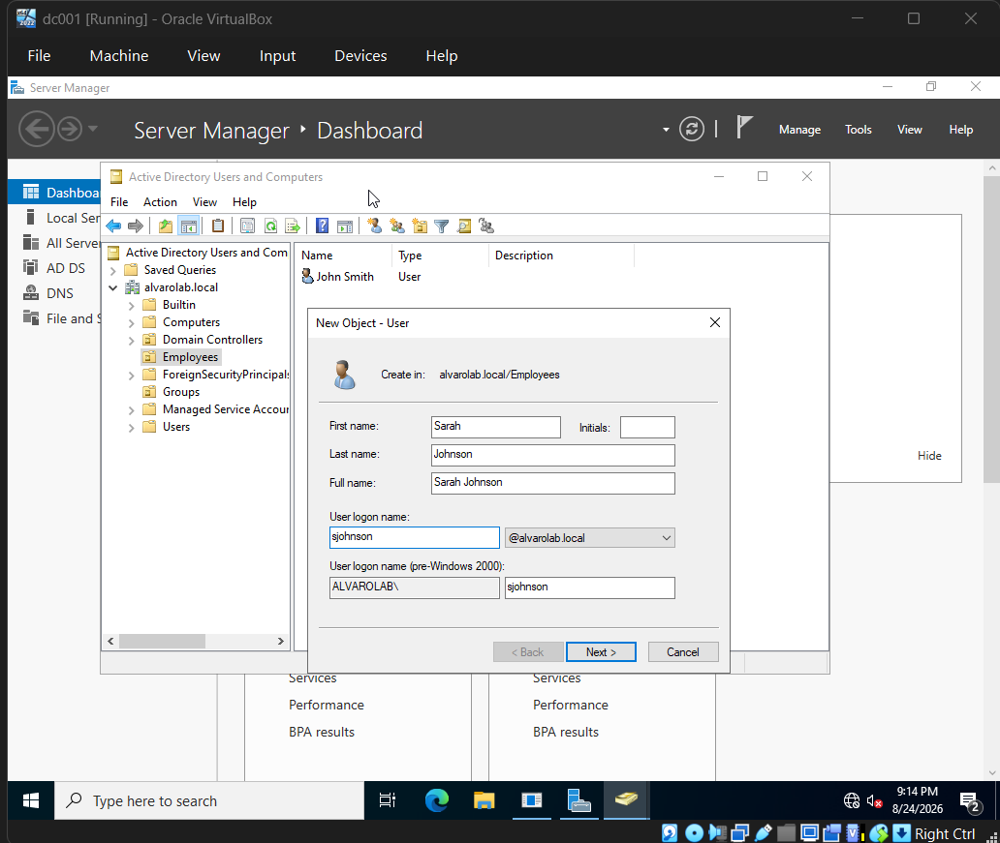

### Ticket Resolution

**Status: Completed**

The new employee account was created, assigned to the appropriate Active Directory security group, and successfully authenticated from the domain-joined workstation.

---

# Skills Demonstrated

- IT help desk troubleshooting
- Active Directory administration
- Active Directory Users and Computers (ADUC)
- User account provisioning
- Account lockout troubleshooting
- Password resets
- Security group management
- Employee onboarding
- Windows domain authentication
- Static IPv4 configuration
- Network connectivity troubleshooting
- `ipconfig`
- `ping`
- `whoami`
- `whoami /groups`
- Problem diagnosis
- Resolution verification
- Technical documentation

---

# Troubleshooting Methodology

Throughout the lab, I followed a consistent support process:

1. Identify the user's reported problem.
2. Reproduce or confirm the issue.
3. Gather relevant account or network information.
4. Identify the likely cause.
5. Apply a targeted resolution.
6. Test the affected system.
7. Verify that the user's functionality was restored.
8. Document the resolution.

# What I Learned

This lab provided hands-on practice handling common help desk requests in a Windows Active Directory environment.

I practiced supporting existing users through account unlocks and password resets, troubleshooting workstation network connectivity, and provisioning a new employee account with appropriate security-group membership.

The lab also reinforced the importance of verifying a resolution instead of assuming that an administrative change fixed the user's problem.
